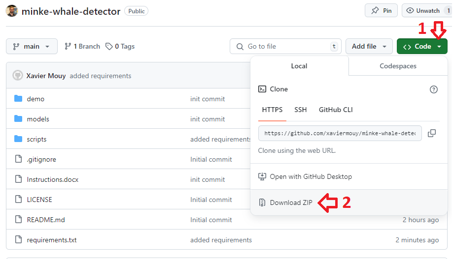

# North Atlantic minke whale pulse train detector

This repository has scripts to run the North Atlantic minke whale pulse train detector developped at the Passive Acoustic Branch of the NOAA Northeast Fisheries Science Center. This is not yet the final release, so please use at your own risks. Any questions, issues, please contact me.

To use the detector, download/clone the repo and read the document Instructions.docx. It you don't use Git, you can download the full repository as a zip file by clicking the green "Clone" button and selecting "Download ZIP" at the bottom of the drop-down menu.

